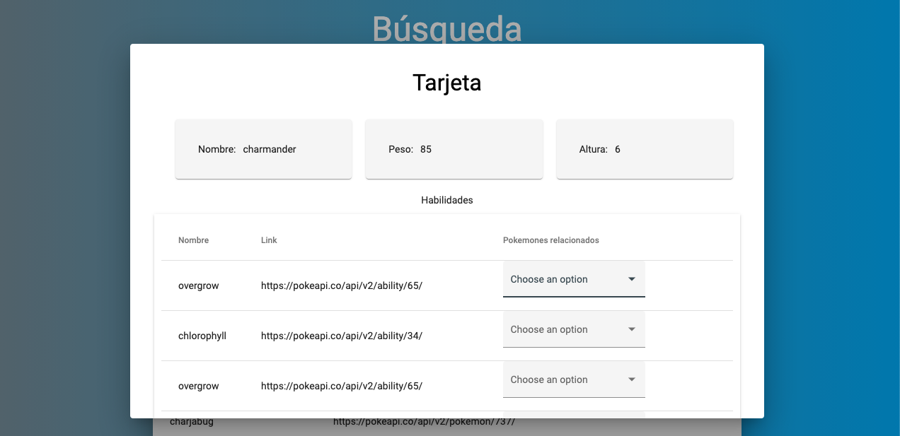

# Descripción general

Este es un proyecto desarrollado como prueba para la empresa Kapta que se desarrolló utilizando el framework Angular con elementos gráficos de Material Design. Consiste básicamente en una plataforma web que permite econsultar el listado de pokemones del API Pokeapi y filtrar la consulta por el nombre.

# Vista previa

Se presentan a continuación algunos pantallazos que muestran la parte gráfica de la aplicación:

# Instrucciones

Para poder correr este proyecto en un navegador local es necesario seguir los siguientes pasos:

* Clonar el proyecto
* Generar las dependencias corriendo el comando npm install sobre la raíz del proyecto
* Ejecutar el comando ng serve que despliega la aplicación 
* Abrir el navegador en localhost:4200